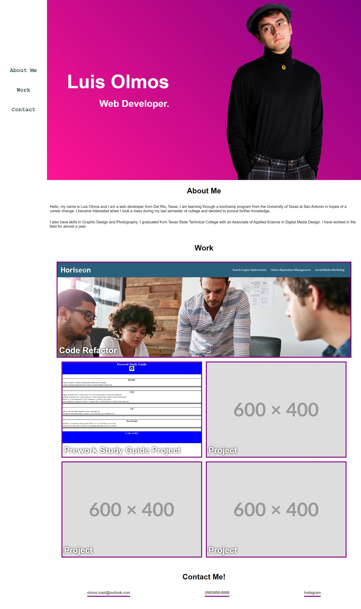

# Professional Portfolio Challenge

## Description

This project will focus on my knowledge of advanced CSS. Mainly with flexbox, media queries, and CSS variables.

This site will contain the developer's name, photo, links to the about them section, to their work, and how to contact
them. The listed works will also be displayed, with the first one being the largest image. The site will also be responsive
for other devices. The site also contains a fixed side navigation bar, but turns into a normal navigation bar located on the
top when resized to a resolution below 768 pixels.

## Screenshot

## Deployed Link

https://cazthetraveler.github.io/Luis-Olmos-Portfolio/